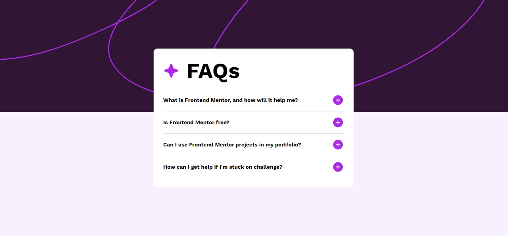

# Frontend Mentor - FAQ accordion solution

This is a solution to the [FAQ accordion challenge on Frontend Mentor](https://www.frontendmentor.io/challenges/faq-accordion-wyfFdeBwBz). Frontend Mentor challenges help you improve your coding skills by building realistic projects.

## Table of contents

- [Overview](#overview)
  - [The challenge](#the-challenge)
  - [Screenshot](#screenshot)
  - [Links](#links)
- [My process](#my-process)
  - [Built with](#built-with)
  - [What I learned](#what-i-learned)
  - [Continued development](#continued-development)
  - [Useful resources](#useful-resources)
- [Author](#author)

## Overview

Frontend Mentor FAQ accordion project

### The challenge

Users should be able to:

- Hide/Show the answer to a question when the question is clicked
- Navigate the questions and hide/show answers using keyboard navigation alone
- View the optimal layout for the interface depending on their device's screen size
- See hover and focus states for all interactive elements on the page

### Screenshot

### Links

- Solution URL: https://www.frontendmentor.io/solutions/faq-accordion-solution-fx6JpoLfda
- Live Site URL: https://ninjablacksox2020.github.io/faq-accordion/

## My process

First I started with html and markup trying to be as semantic as possible. Then I worked on positioning and styling. Had quite a bit of trouble with the background image, and still am not 100% that it works the way I want it to. Once that was done, I worked on worked screen responsiveness, and lastly some javascript to handle button clicks and tabbing.

### Built with

- Semantic HTML5 markup
- CSS custom properties
- Flexbox
- Javascript

### What I learned

How to handle events with javascript

icon.addEventListener('click', toggleAnswer);
icon.addEventListener('keydown', function (event) {

      if (event.key === 'Enter' || event.key === ' ') {
        event.preventDefault();
        toggleAnswer.call(this);
      }

Getting better with positioning in CSS flexbox
.faq\_\_wrapper {
display: flex;
flex-direction: column;
background-color: var(--white);
width: 100%;
max-width: 500px;
border-radius: .75rem;
padding: 2rem;
word-wrap: break-word;
}

### Continued development

Could always getting better at CSS Layout and need to learn more Javascript

### Useful resources

- https://www.w3schools.com/ is a great resource for fullstack

## Author

- Website - https://ninjablacksox2020.github.io/faq-accordion/
- Frontend Mentor - https://www.frontendmentor.io/profile/ninjablacksox2020
